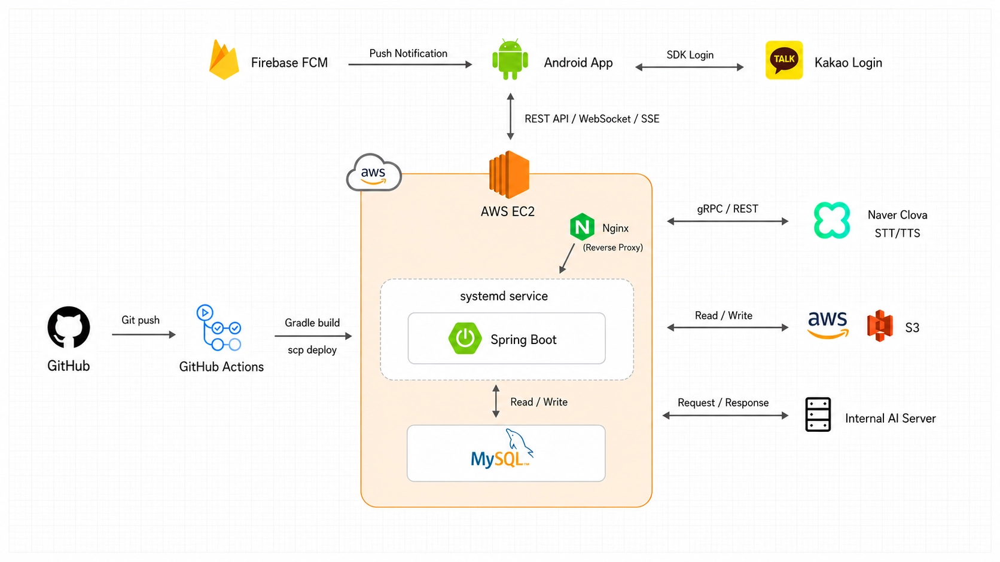
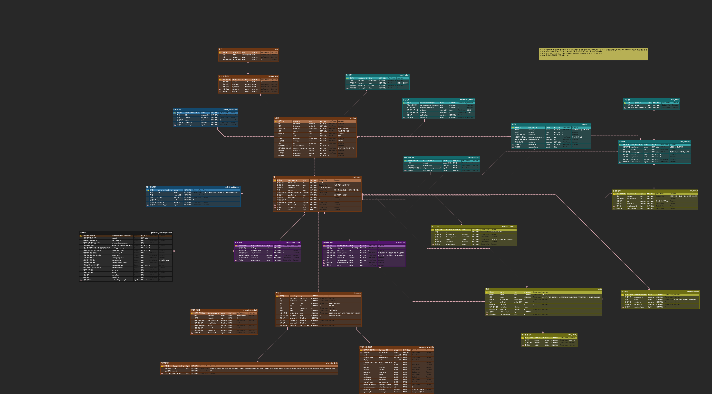

# 📞 CallFromAI

> AI 캐릭터와 **채팅**하고 **실시간 통화**할 수 있는 서비스, CallFromAI의 백엔드 레포지토리입니다.

<br>

## 🙌 팀원 구성

<div align="center">

|                                                              **이석민** (LEAD)                                                               | **강준우** | **배준혁** | **현경** |
|:-----------------------------------------------------------------------------------------------------------------------------------------:| :------: | :------: | :------: |
| [ <br/> @seokMini-2](https://github.com/seokMini-2) | [ <br/> @oofrog](https://github.com/oofrog) | [ <br/> @philbae0](https://github.com/philbae0) | [ <br/> @hyeonky0w0](https://github.com/hyeonky0w0) |

</div>

<br>

## 🔧 기술 스택

- **Spring Boot 3.3.4**
  - 애플리케이션 서버 (Java 17)
- **MySQL 8**
  - RDBMS (Spring Data JPA)
- **Spring Security + JWT**
  - 인증/인가 (`jjwt` 기반 토큰 발급·검증)
- **WebSocket**
  - 통화 오디오 업스트림/다운스트림 실시간 채널
- **gRPC + CLOVA Speech / CLOVA Voice**
  - 실시간 음성 인식(STT) 스트리밍 중계 및 음성 합성(TTS)
- **Firebase Cloud Messaging (FCM)**
  - 채팅·통화 푸시 알림
- **AWS S3**
  - 채팅 사진·통화 녹음 저장 및 presigned URL 서빙
- **Swagger (springdoc-openapi)**
  - API 문서 자동화
- **배포 환경** : GitHub Actions(CI/CD) → AWS EC2 (Ubuntu, systemd)

---

## 📖 프로젝트 구조 (Domain Driven Design)

기능(도메인) 단위로 패키지를 나누고, 각 도메인 내부를 역할별 레이어(controller·service·repository 등)로 구성합니다.

```dockerignore
📞CallFromAI-BE
 ┣ 📂.github
 ┃ ┗ 📂workflows                # GitHub Actions (배포·코드리뷰) 워크플로우
 ┣ 📂src
 ┃ ┗ 📂main
 ┃   ┣ 📂java
 ┃   ┃ ┗ 📂com
 ┃   ┃   ┗ 📂example
 ┃   ┃     ┗ 📂umcCall
 ┃   ┃       ┣ 📂domain                 # 도메인별 패키지 (아래 공통 구조로 구성)
 ┃   ┃       ┃ ┣ 📂auth                 # 인증/로그인 (JWT, 소셜 로그인)
 ┃   ┃       ┃ ┣ 📂member               # 회원/마이페이지
 ┃   ┃       ┃ ┣ 📂character            # AI 캐릭터
 ┃   ┃       ┃ ┣ 📂relationship         # 캐릭터-회원 관계
 ┃   ┃       ┃ ┣ 📂chat                 # 채팅 (메시지·사진)
 ┃   ┃       ┃ ┣ 📂call                 # 통화 (WebSocket 오디오, 녹음, STT/TTS)
 ┃   ┃       ┃ ┣ 📂proactive            # 선제 연락 (AI가 먼저 말 걸기)
 ┃   ┃       ┃ ┣ 📂ai                   # AI 서버 연동 클라이언트
 ┃   ┃       ┃ ┣ 📂notification         # 알림 + 📂push(FCM)
 ┃   ┃       ┃ ┣ 📂image                # 이미지 리소스
 ┃   ┃       ┃ ┗ 📂term                 # 약관
 ┃   ┃       ┃   ┣ 📂controller         # API 엔드포인트(요청/응답 매핑)
 ┃   ┃       ┃   ┣ 📂service            # 도메인별 핵심 비즈니스 로직
 ┃   ┃       ┃   ┣ 📂repository         # JPA Repository 인터페이스
 ┃   ┃       ┃   ┣ 📂entity             # JPA 엔티티(DB 매핑 클래스)
 ┃   ┃       ┃   ┣ 📂dto                # 요청/응답 DTO (request·response)
 ┃   ┃       ┃   ┣ 📂enums              # 도메인 열거형
 ┃   ┃       ┃   ┣ 📂event              # 이벤트 발행/리스너
 ┃   ┃       ┃   ┗ 📂exception          # 도메인 예외 정의
 ┃   ┃       ┣ 📂global                 # 전역 공통 모듈
 ┃   ┃       ┃ ┣ 📂apiPayload           # 공통 응답 포맷·에러 코드
 ┃   ┃       ┃ ┣ 📂config               # 프로젝트 전역 설정(Security, Web 등)
 ┃   ┃       ┃ ┣ 📂security             # 인증/인가 필터·유틸
 ┃   ┃       ┃ ┣ 📂entity               # 공통 엔티티(BaseEntity 등)
 ┃   ┃       ┃ ┣ 📂exception            # 전역 예외 처리
 ┃   ┃       ┃ ┗ 📂infra                # 외부 인프라 어댑터(FCM, S3)
 ┃   ┃       ┗ 📜umcCallApplication.java   # Spring Boot 메인 실행 클래스
 ┃   ┗ 📂resources
 ┃     ┣ 📜application.yml            # 공통 프로필
 ┃     ┣ 📜application-local.yml      # 로컬 프로필
 ┃     ┗ 📜application-prod.yml       # 운영 프로필
 ┣ 📜.gitignore
 ┣ 📜README.md
 ┗ 📜build.gradle
```

> 도메인별로 책임을 분리하고, 도메인 내부는 역할에 따른 계층 분리를 통해 각 레이어의 책임을 명확히 합니다.

---

## 📖 브랜치 전략

우리 프로젝트는 **Git Flow** 전략을 기반으로 하며, 모든 기능 개발은 Issue 기반으로 브랜치를 생성하여 진행합니다.

| Branch | 설명 |
| :--- | :--- |
| `main` | 실제 배포(CI/CD)를 위한 브랜치입니다. `develop`에서 검증된 버전만 병합합니다. |
| `develop` | 다음 버전을 위한 개발 중심 브랜치입니다. 코드 리뷰 후 병합합니다. |
| `feat/#이슈번호` | 새로운 기능 구현을 위한 브랜치입니다. `develop`에서 분기 → `develop`으로 병합합니다. |
| `refactor/#이슈번호` | 내부 동작 변경 없이 코드를 개선하는 리팩터링용 브랜치입니다. |
| `fix/#이슈번호` | 버그 수정용 브랜치입니다. |
| `chore/#이슈번호` | 빌드 설정, 의존성, 환경 설정 등 기타 작업용 브랜치입니다. |

> 모든 브랜치는 명확한 목적에 맞게 사용하며, 적절한 브랜치로 병합되어야 합니다.
>
> **예시: `feat/#13-kakao-login`**

---

## 📖 Commit Convention

`<Prefix>: <Description> (#<Issue_Number>)` 양식을 준수하며, 끝맺음은 명사(~ 추가, ~ 작업 등)로 통일합니다.

| Type | Description |
| :--- | :--- |
| `feat` | 새로운 기능 추가 &nbsp;`feat: 구글 로그인 API 기능 추가 (#11)` |
| `fix` | 버그 수정 &nbsp;`fix: 로그인 토큰 만료 에러 수정 (#10)` |
| `refactor` | 내부 로직 변경 없이 코드 개선 &nbsp;`refactor: 채팅 저장 로직 정리 (#15)` |
| `del` | 파일 삭제 및 불필요한 코드 제거 &nbsp;`del: 사용하지 않는 import 제거 (#12)` |
| `docs` | README·문서 수정 &nbsp;`docs: 리드미 수정 (#14)` |
| `test` | 테스트 코드 작성 및 수정 &nbsp;`test: 로그인 API 테스트 코드 작성 (#20)` |
| `chore` | 의존성·yml·패키지 구조 등 기타 작업 &nbsp;`chore: lombok 의존성 추가 (#22)` |
| `perf` | 성능 개선 |
| `ci` / `cd` | CI/CD 파이프라인 관련 수정 |
| `revert` | 특정 커밋 되돌리기 |

---

## 📖 Pull Request 컨벤션

PR 제목은 `<Prefix>: <Description>` 양식을 준수하며, prefix는 Commit Convention을 따릅니다.

> **예시: `FEAT: 카카오 로그인 구현`**

```
## Summary
- 요약

## Related Issue
- close #이슈번호

## Describe your code
   * 작업 내용 (What I Did) : 구현한 기능의 요약 설명 작성
   * 스크린샷/결과 (Optional) : API 테스트 결과 첨부
   * 논의사항/질문 (To Reviewers) : 리뷰어들이 집중해서 봐주었으면 하는 부분 기술

## Checklist
- [ ] 리뷰어 등록
```

- PR 생성 시 24시간 이내에 확인을 요합니다.
- `develop` 브랜치로의 병합은 **최소 1명 이상의 리뷰어 승인(Approve)** 이 필요합니다.
- Related Issue에 `close #이슈번호`를 작성하면 병합 시 연결된 이슈가 자동으로 닫힙니다.

**병합 전 확인**

- 로컬에서 먼저 `develop`을 pull 받아 충돌(Conflict) 없음을 확인 후 push합니다.
- CI 빌드/테스트가 모두 통과했는지 확인 후 병합합니다.

---

## 👀 Code Review Rules

상호 간의 성장과 코드 품질 향상을 위해 긍정적이고 생산적인 리뷰 문화를 지향합니다.

- **리뷰 필수 인원** : PR이 병합되기 위해서는 최소 **1명 이상**의 동료 리뷰어에게 Approve를 받아야 합니다.
- **리뷰어의 태도**
  - "왜 이렇게 작성했나요?" 보다는 "~~한 이유로 이 방식이 더 좋을 것 같은데 어떻게 생각하시나요?"와 같이 제안형 어조를 사용합니다.
  - 좋은 코드나 기발한 로직에는 아낌없는 칭찬(리액션)을 보냅니다.
- **피드백 반영** : 리뷰 요청자는 리뷰어가 남긴 코멘트에 대해 반영 여부나 의견을 반드시 댓글로 남기고, 수정이 완료되면 알려줍니다.

---

## 📖 Code Convention

일관성 있는 코드 스타일과 유지보수성을 위해 다음 규칙을 준수합니다.

- **네이밍 규칙**
  - **Class / Interface** : UpperCamelCase (`ChatService`, `CallController`)
  - **Method / Variable** : lowerCamelCase (`sendMessage()`, `chatRoomId`)
  - **Constant** : SNAKE_CASE (`MAX_UPLOAD_SIZE`)
  - **Package** : 모두 소문자, 단어 구분 시 점(`.`) 사용 (`com.example.umcCall.domain`)
- **Lombok 사용 가이드**
  - 무분별한 `@Data` 사용을 지양하고 `@Getter`, `@RequiredArgsConstructor` 위주로 사용합니다.
  - 엔티티에는 `@Setter` 대신 의미 있는 비즈니스 메서드를 정의합니다.
- **코드 포맷터**
  - 작업 전 인텔리제이 내장 포맷터(`Ctrl + Alt + L`)를 생활화합니다.
  - 쓰이지 않는 Import문은 항상 정리합니다 (`Ctrl + Alt + O`).

---

## ⭐ 서버 아키텍처 다이어그램



<br>

## 🗂️ ERD

